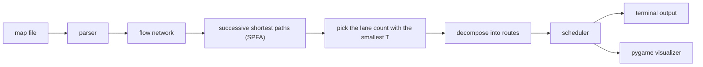
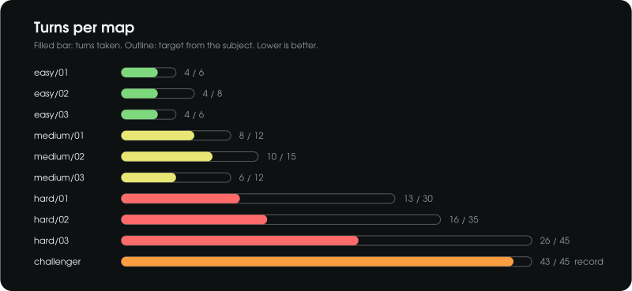
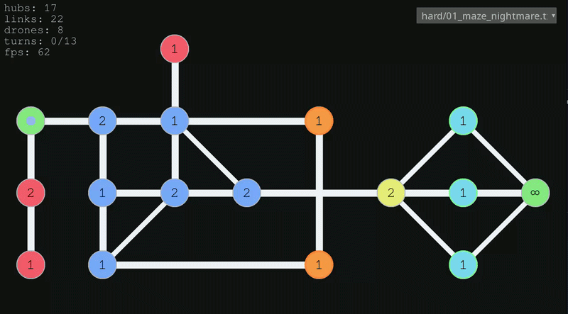

*This project has been created as part of the 42 curriculum by jbenhass.*

<p align="center">
  
</p>

<p align="center">
  
  
  
  
  
  
  
  
</p>

<p align="center">
  <a href="#instructions">Instructions</a> |
  <a href="#algorithm">Algorithm</a> |
  <a href="#results">Results</a> |
  <a href="#visualizer">Visualizer</a> |
  <a href="#example">Example</a>
</p>

## Description

Fly-in moves a fleet of drones from a start hub to an end hub through a network
of zones, in as few turns as possible. Zones and connections have capacities,
restricted zones take 2 turns to enter, blocked zones are off limits, and
priority zones should be preferred.

The program reads a map, computes the whole plan up front, prints one line per
turn in the format asked by the subject, and opens a small pygame window to
replay the plan.

**Highlights**

- Optimal number of turns on every provided map, and 43 turns on the
  challenger map (record: 45).
- A real flow algorithm (successive shortest paths) instead of a BFS.
- Fully typed (`mypy --strict`), object-oriented, no graph library.

## Instructions

You need Python >=3.10 and [uv](https://docs.astral.sh/uv/).

```sh
make install                                    # uv sync
make run                                        # default map (easy/01)
make run MAP=data/maps/hard/02_capacity_hell.txt
make run MAP=path/to/map.txt ARGS=--no-gui      # terminal output only
make debug MAP=path/to/map.txt                  # same thing under pdb
make lint                                       # flake8 + mypy
make lint-strict                                # flake8 + mypy --strict
make clean
```

Without make: `uv run python -m src <map> [--no-gui]`.

If a map is invalid, the error shows the line and the cause, and the program
exits with code 1. Same thing if the map has no solution.

## Algorithm



### How I got there

I really wanted to implement a flow algorithm, not just a BFS with drones
waiting in line. I started with Ford-Fulkerson (the max-flow algorithm), then
moved to successive shortest paths with Dijkstra, then switched to
Bellman-Ford (SPFA) because the residual graph has negative edges and I didn't
want to deal with Johnson potentials. I also got stuck for a while on
capacities: in a flow network they live on edges, but in Fly-in `max_drones`
is on the hubs. Splitting each hub in two fixed that.

The hardest part was making Ford-Fulkerson's theorem fit the way Fly-in sets
its limits. It also took me a while to get that "Ford-Fulkerson" is two
different things: the max-flow algorithm (1956) and the theorem on flows over
time (1958). The second one is what proves this approach is optimal.

### How it works

1. **Build the network.** Each hub becomes `hub-in -> hub-out` with capacity
   `max_drones` (unlimited for start and end). Each connection becomes two
   directed edges, one per direction, with capacity `max_link_capacity` and a
   cost equal to the turns needed to enter the destination zone (1 for
   normal/priority, 2 for restricted). Blocked zones are left out. Costs are
   pairs `(turns, non-priority zones)` compared in order, so priority only
   breaks ties.
2. **Successive shortest paths.** Find the cheapest path in the residual graph
   with SPFA, push 1 unit of flow, repeat. Each unit is a lane that can carry
   one drone per turn. Reverse edges have a negative cost, which lets a later
   path undo part of an earlier one.
3. **Pick the number of lanes.** With `k` lanes of total length `C`, the last
   drone arrives at `T = ceil((N + C) / k) - 1`. More lanes spread the drones
   but use longer paths, so I stop as soon as `T` goes up and undo that last
   path.
4. **Decompose the flow** into routes: the list of steps with the turn each
   hub is reached.
5. **Schedule.** A route of length `L` offers `T - L + 1` departure slots
   (delays `0` to `T - L`). Slots are sorted by arrival turn and the first `N`
   become D1 to DN. Drones only wait at the start. A drone entering a
   restricted zone shows up as `D<id>-<from>-<to>` for one turn, then
   `D<id>-<to>`.

### Why it's optimal

Ford and Fulkerson (1958) showed that repeating a min-cost static flow over
time sends the maximum possible amount to the sink by time `T`. Successive
shortest paths gives the min cost for every number of lanes, and the lane
count with the smallest `T` is the fastest possible plan. There are no
collisions or deadlocks: everything is planned before the first turn and each
lane holds at most one drone per hub per turn.

Complexity: successive shortest paths is `O(k * V * E)` in the worst case with
SPFA (`k` lanes, `V` = 2 x hubs, `E` about hubs + 2 x connections), and the
scheduling is `O(N log N)`. The plan is computed once per map.

## Results



<details>
<summary>Same results as a table</summary>

| Map        | Drones | Turns | Target    |
|------------|--------|-------|-----------|
| easy/01    | 2      | 4     | <= 6      |
| easy/02    | 4      | 4     | <= 8      |
| easy/03    | 4      | 4     | <= 6      |
| medium/01  | 5      | 8     | <= 12     |
| medium/02  | 6      | 10    | <= 15     |
| medium/03  | 5      | 6     | <= 12     |
| hard/01    | 8      | 13    | <= 30     |
| hard/02    | 12     | 16    | <= 35     |
| hard/03    | 15     | 26    | <= 45     |
| challenger | 25     | **43**| record 45 |

</details>

## Choices I made

- I kept things simple and used hub names (plain strings) to handle the data:
  network nodes are `name-in` / `name-out` and route steps are `from-to`. This
  works because the subject forbids dashes in zone names.
- Priority zones only break ties between equally fast paths. The algorithm
  never loses a turn just to go through one.
- `max_drones` on the start and end hubs is ignored.
- Anything after a `#` is a comment, even at the end of a line.

> [!NOTE]
> A drone finishing a restricted transit frees the connection on the turn it
> arrives, the same way drones moving out of a zone free it that same turn.
> The optimality result above relies on this reading of the rules.

<details>
<summary><b>Project structure</b></summary>

```
.
|-- Makefile
|-- pyproject.toml
|-- assets/              README media
|-- data/maps/           subject maps (easy, medium, hard, challenger)
`-- src/
    |-- main.py          CLI entry point
    |-- parsing/         map loader, line parser, map builder
    |-- models/          map types, flow network, routes
    |-- algo/            successive shortest paths + scheduler, SPFA / Bellman-Ford
    `-- ui/              session, terminal renderer, pygame visualizer
```

</details>

## Visualizer



- The window replays the plan computed by the algorithm, turn by turn.
- Hubs use the color from the map file. The ring shows the zone type: light
  grey for normal, green for priority, orange for restricted, dark grey for
  blocked.
- Drones are animated between turns. A drone in restricted transit sits in
  the middle of the connection.
- Left and right arrows step through the turns, backwards too. The turn
  counter is at the top left.
- The dropdown at the top right switches between the maps in `data/maps`
  (plus the one given on the command line), and the terminal output is
  printed again for the new map.
- With `--no-gui`, or if no display is available, you only get the terminal
  output.

It makes it easy to see how the drones are split between lanes and how they
leave the start one after another.

## Example

Input (`data/maps/easy/02_simple_fork.txt`):

```
nb_drones: 4

start_hub: start 0 0 [color=green]
hub: junction 1 0 [color=yellow max_drones=2]
hub: path_a 2 1 [color=blue]
hub: path_b 2 -1 [color=blue]
end_hub: goal 3 0 [color=red]

connection: start-junction [max_link_capacity=2]
connection: junction-path_a
connection: junction-path_b
connection: path_a-goal
connection: path_b-goal
```

Output:

```
D1-junction D2-junction
D1-path_a D2-path_b D3-junction D4-junction
D1-goal D2-goal D3-path_a D4-path_b
D3-goal D4-goal
```

Two lanes of length 3 with 2 departure slots each: 4 drones in 4 turns.

## Resources

- [Minimum-cost flow, successive shortest path algorithm](https://cp-algorithms.com/graph/min_cost_flow.html) (cp-algorithms)
- [An Introduction to Network Flows Over Time](https://www3.math.tu-berlin.de/Vorlesungen/SS08/NetOpt/flows_over_time.pdf), Martin Skutella (2009)
- L. R. Ford and D. R. Fulkerson, *Constructing maximal dynamic flows from
  static flows*, Operations Research 6 (1958), pp. 419-433

### AI usage

I used AI for code review and to get explanations of the theory behind the
algorithm (min-cost flows, successive shortest paths and Ford-Fulkerson's
theorem on flows over time).
